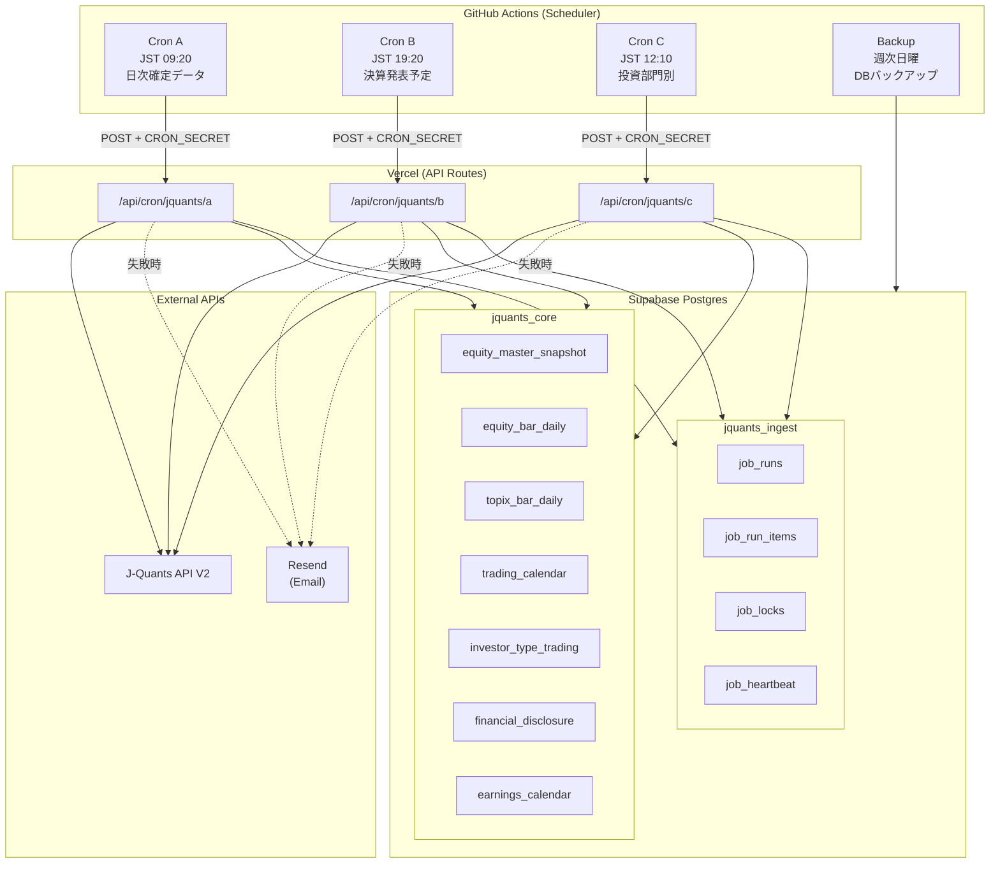
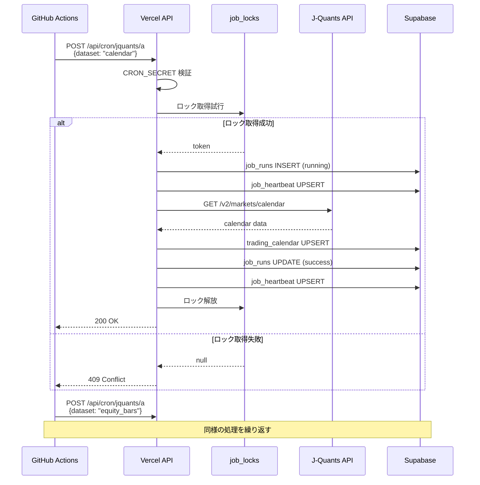
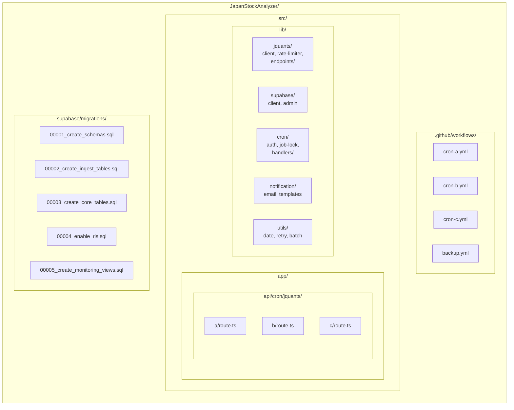
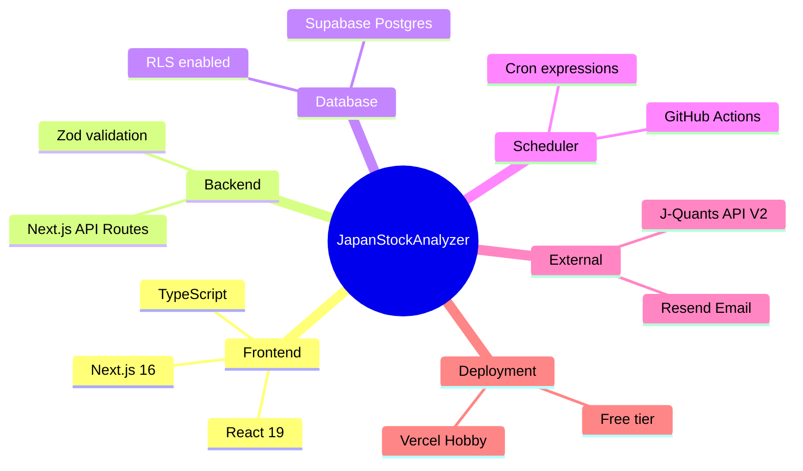

# JapanStockAnalyzer アーキテクチャ図

## 1. 全体構成図

```mermaid
flowchart TB
    subgraph GitHub["GitHub Actions (Scheduler)"]
        CronA["Cron A<br/>JST 09:20<br/>日次確定データ"]
        CronB["Cron B<br/>JST 19:20<br/>決算発表予定"]
        CronC["Cron C<br/>JST 12:10<br/>投資部門別"]
        Backup["Backup<br/>週次日曜<br/>DBバックアップ"]
    end

    subgraph Vercel["Vercel (API Routes)"]
        RouteA["/api/cron/jquants/a"]
        RouteB["/api/cron/jquants/b"]
        RouteC["/api/cron/jquants/c"]
    end

    subgraph External["External APIs"]
        JQuants["J-Quants API V2"]
        Resend["Resend<br/>(Email)"]
    end

    subgraph Supabase["Supabase Postgres"]
        subgraph Core["jquants_core"]
            equity_master["equity_master_snapshot"]
            equity_bar["equity_bar_daily"]
            topix["topix_bar_daily"]
            calendar["trading_calendar"]
            investor["investor_type_trading"]
            financial["financial_disclosure"]
            earnings["earnings_calendar"]
        end
        subgraph Ingest["jquants_ingest"]
            job_runs["job_runs"]
            job_items["job_run_items"]
            job_locks["job_locks"]
            heartbeat["job_heartbeat"]
        end
    end

    CronA -->|"POST + CRON_SECRET"| RouteA
    CronB -->|"POST + CRON_SECRET"| RouteB
    CronC -->|"POST + CRON_SECRET"| RouteC

    RouteA --> JQuants
    RouteB --> JQuants
    RouteC --> JQuants

    RouteA --> Core
    RouteB --> Core
    RouteC --> Core

    RouteA --> Ingest
    RouteB --> Ingest
    RouteC --> Ingest

    RouteA -.->|"失敗時"| Resend
    RouteB -.->|"失敗時"| Resend
    RouteC -.->|"失敗時"| Resend

    Backup --> Supabase
```

## 2. Cron A 処理フロー

```mermaid
sequenceDiagram
    participant GA as GitHub Actions
    participant API as Vercel API
    participant Lock as job_locks
    participant JQ as J-Quants API
    participant DB as Supabase

    GA->>API: POST /api/cron/jquants/a<br/>{dataset: "calendar"}
    API->>API: CRON_SECRET 検証
    API->>Lock: ロック取得試行
    alt ロック取得成功
        Lock-->>API: token
        API->>DB: job_runs INSERT (running)
        API->>DB: job_heartbeat UPSERT
        API->>JQ: GET /v2/markets/calendar
        JQ-->>API: calendar data
        API->>DB: trading_calendar UPSERT
        API->>DB: job_runs UPDATE (success)
        API->>DB: job_heartbeat UPSERT
        API->>Lock: ロック解放
        API-->>GA: 200 OK
    else ロック取得失敗
        Lock-->>API: null
        API-->>GA: 409 Conflict
    end

    GA->>API: POST /api/cron/jquants/a<br/>{dataset: "equity_bars"}
    Note over GA,DB: 同様の処理を繰り返す
```

## 3. データベーススキーマ

```mermaid
erDiagram
    trading_calendar {
        date calendar_date PK
        text hol_div
        boolean is_business_day
        jsonb raw_json
        timestamptz ingested_at
    }

    equity_master_snapshot {
        date as_of_date PK
        text local_code PK
        text company_name
        text sector17_code
        text market_code
        jsonb raw_json
        timestamptz ingested_at
    }

    equity_bar_daily {
        text local_code PK
        date trade_date PK
        text session PK
        numeric open
        numeric high
        numeric low
        numeric close
        bigint volume
        numeric adj_close
        jsonb raw_json
        timestamptz ingested_at
    }

    topix_bar_daily {
        date trade_date PK
        numeric open
        numeric high
        numeric low
        numeric close
        jsonb raw_json
        timestamptz ingested_at
    }

    investor_type_trading {
        date published_date PK
        date start_date PK
        date end_date PK
        text section PK
        text investor_type PK
        text metric PK
        numeric value_kjpy
        jsonb raw_json
        timestamptz ingested_at
    }

    financial_disclosure {
        text disclosure_id PK
        date disclosed_date
        text local_code
        jsonb raw_json
        timestamptz ingested_at
    }

    earnings_calendar {
        date announcement_date PK
        text local_code PK
        jsonb raw_json
        timestamptz ingested_at
    }

    job_runs {
        uuid run_id PK
        text job_name
        date target_date
        text status
        timestamptz started_at
        timestamptz finished_at
        text error_message
        jsonb meta
    }

    job_run_items {
        uuid run_id PK,FK
        text dataset PK
        text status
        bigint row_count
        timestamptz started_at
        timestamptz finished_at
    }

    job_locks {
        text job_name PK
        timestamptz locked_until
        uuid lock_token
        timestamptz updated_at
    }

    job_heartbeat {
        text job_name PK
        timestamptz last_seen_at
        text last_status
        uuid last_run_id
        date last_target_date
    }

    job_runs ||--o{ job_run_items : "has"
```

## 4. ディレクトリ構成

```mermaid
graph LR
    subgraph Root["JapanStockAnalyzer/"]
        subgraph GH[".github/workflows/"]
            cronA["cron-a.yml"]
            cronB["cron-b.yml"]
            cronC["cron-c.yml"]
            backup["backup.yml"]
        end

        subgraph Src["src/"]
            subgraph App["app/"]
                subgraph API["api/cron/jquants/"]
                    routeA["a/route.ts"]
                    routeB["b/route.ts"]
                    routeC["c/route.ts"]
                end
            end

            subgraph Lib["lib/"]
                jquants["jquants/<br/>client, rate-limiter,<br/>endpoints/"]
                supabase["supabase/<br/>client, admin"]
                cron["cron/<br/>auth, job-lock,<br/>handlers/"]
                notification["notification/<br/>email, templates"]
                utils["utils/<br/>date, retry, batch"]
            end
        end

        subgraph SB["supabase/migrations/"]
            m1["00001_create_schemas.sql"]
            m2["00002_create_ingest_tables.sql"]
            m3["00003_create_core_tables.sql"]
            m4["00004_enable_rls.sql"]
            m5["00005_create_monitoring_views.sql"]
        end
    end
```

## 5. 技術スタック

```mermaid
mindmap
    root((JapanStockAnalyzer))
        Frontend
            Next.js 16
            React 19
            TypeScript
        Backend
            Next.js API Routes
            Zod validation
        Database
            Supabase Postgres
            RLS enabled
        Scheduler
            GitHub Actions
            Cron expressions
        External
            J-Quants API V2
            Resend Email
        Deployment
            Vercel Hobby
            Free tier
```

## 6. Cron スケジュール

```mermaid
gantt
    title 日次処理スケジュール (JST)
    dateFormat HH:mm
    axisFormat %H:%M

    section Cron A
    日次確定データ同期 :a1, 09:20, 10m

    section Cron C
    投資部門別 + 整合性チェック :c1, 12:10, 5m

    section Cron B
    決算発表予定取得 :b1, 19:20, 5m
```
